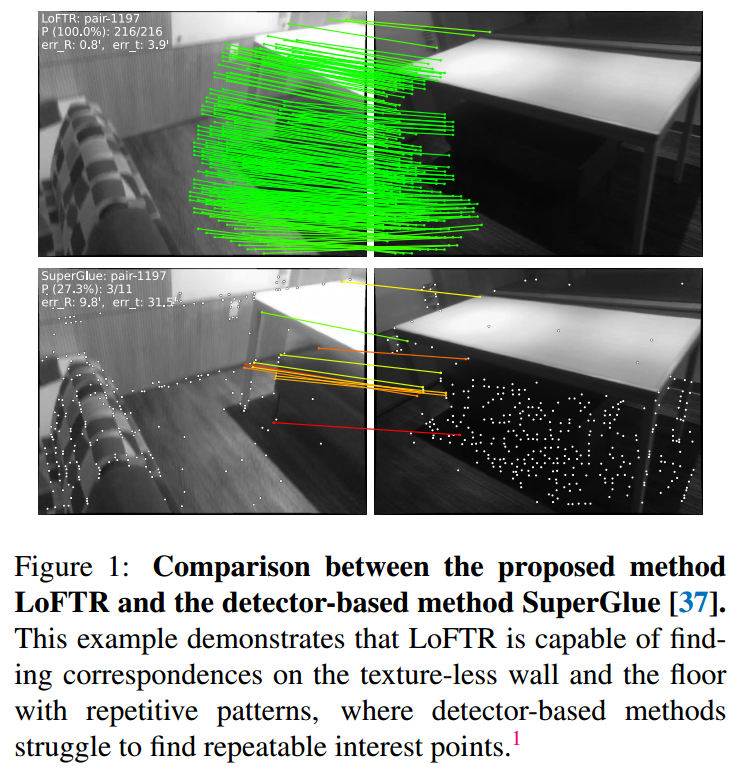
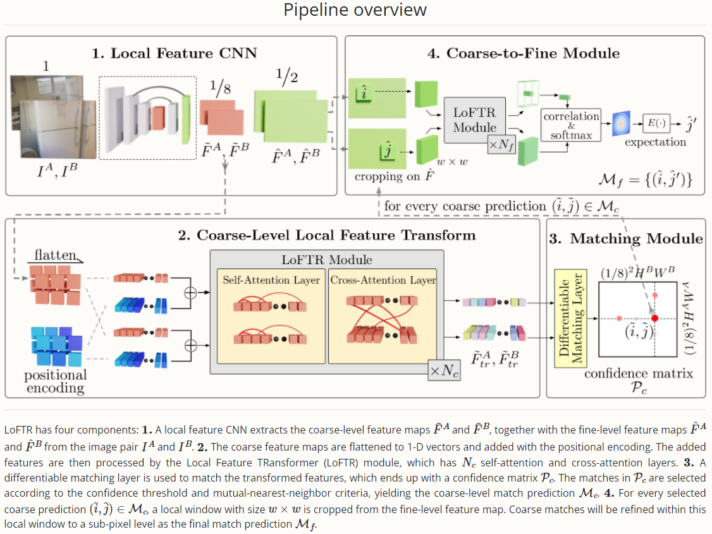
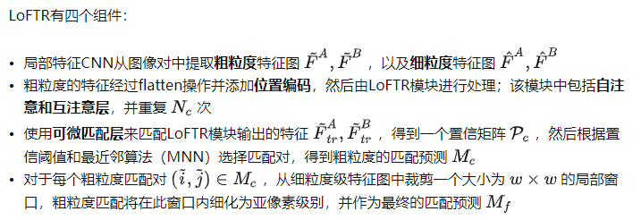
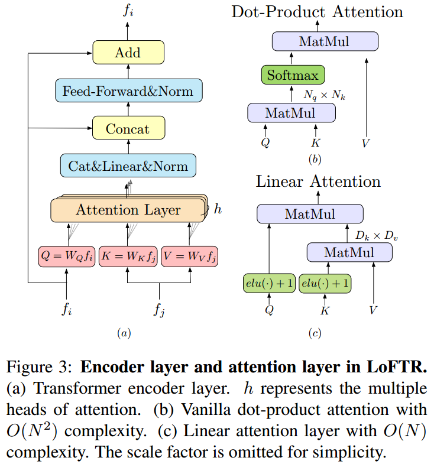
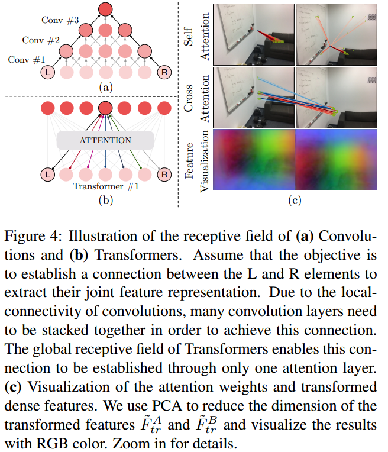

# LoFTR: Detector-Free Local Feature Matching with Transformers
Paper: https://arxiv.org/pdf/2104.00680.pdf
    https://zju3dv.github.io/loftr/files/LoFTR-suppmat.pdf    
    https://zju3dv.github.io/loftr/files/LoFTR_IMC21.pdf (2021 Image Matching Challenge 技术细节，2页)
code: https://github.com/zju3dv/LoFTR 
项目主页：https://zju3dv.github.io/loftr/
期刊: CVPR2021

## Abstract
本文提出了一种新的局部图像特征匹配方法。首先在粗粒度级别上（coarse level）建立像素级稠密匹配，然后在细粒度级别上优化匹配，而不是传统的依次进行图像特征检测、描述和匹配。与使用cost volume来搜索对应关系的稠密方法相比，本文在Transformer中使用了自注意力层和交叉注意力层来获得两幅图像的特征描述。Transformer提供的全局感受野使得我们的方法能在若纹理区域产生稠密匹配，而特征检测通常在该区域难以产生特征点。室内室外数据集上的实验表明LoFTR性能远超最先进算法。在两个视觉定位benchmark中的公开方法中排第一。

## 1 简介

>仅显示RANSAC处理后的内点匹配。绿色表示归一化图像坐标下的匹配的对极误差小于5e-4。

图像的局部特征匹配应用广泛，如SfM，SLAM，视觉定位等。大部分方法需要三步：图像特征检测、描述和匹配。
特征检测减少了匹配的搜索空间，得到的稀疏匹配对于大部分任务足够，如相机位姿估计。然而特征检测器往往在弱纹理、重复纹理、视角变化、光照变化和运动模糊场景中难以得到可重复的、足够的特征点。尤其是室内场景，弱纹理、重复纹理通常占据视野内大部分区域。如图1，没有可重复的特征点，即使使用完美的描述子也不可能找到正确的匹配。

一些工作尝试优化该问题，建立像素级稠密匹配。高置信度的匹配可以从这些稠密匹配中选取，从而避免了特征检测。然而这些文章用**CNN提取的稠密特征具有有限的感受野**，可能不能区分不明显的区域（困难场景）。相反人类识别不明显区域不仅依赖于局部，还使用全局信息。这个观察表明**一个大的感受野在特征提取网络中是很重要的。**

受SuperGlue启发，使用带自注意力和交叉注意力层的Transformer来处理（变换）从卷积网络中提取的稠密特征。稠密匹配先从两组小分辨率（1/8分辨率）的变换特征中提取。从这些稠密匹配中选择高置信度的匹配，然后使用一个基于相关的方法来优化到亚像素。Transformer的全局感受野和位置编码使得变换的特征表示是内容相关和位置相关的。通过多次使用自注意力和交叉注意力层，LOFTR学习到了稠密的全局匹配先验。使用线性Transformer来减少计算复杂度。

## 2 相关研究
### Detector-based Local Feature Matching
- 传统手工特征：SIFT,ORB等
- 基于学习的方法：LIFT、MagicPoint是最先成功的学习类局部特征。SuperPoint基于MagicPoint，使用了自监督训练。

上面的方法使用最近邻搜索来匹配特征点。SuperGlue提出基于学习的方法进行局部特征匹配。**SuperGlue输入两组特征点及其描述子，使用GNN学习匹配**（GNN是Transformer的一种通用形式）。SuperGlue基于detector相关的方法，因而仅限于显著区域的特征点匹配，弱纹理区域差。

***本文工作启发自SuperGlue，借鉴了GNN中自注意和互注意来实现消息传递，但是本文提出detector-free 方法。***

### Detector-free Local Feature Matching
Detector-free方法去掉了特征检测过程，直接得到稠密描述子或者稠密匹配。
传统方法：SIFT flow（最早提出稠密特征匹配）
基于学习的方法：[6,39]（第一个基于学习的用于学习稠密描述子的方法，最近邻搜索进行匹配）、NCNet（端到端直接学习稠密匹配，4D cost volume）、DRC-Net（基于NCNet，coarse-to-fine学习稠密匹配）

大部分使用4D cost volume来枚举所有可能的匹配，但是感受野仍然有限，局限于匹配点邻域。

- LoFTR: Detector-Free Local Feature Matching with Transformers，CVPR2021（SOTA）
- SIFT Flow: Dense correspondence across scenes and its applications. TPAMI, 2010（第一次提出Detecer-Free的稠密匹配方法，传统方法）
- Universal correspondence network. NeurIPS, 2016（第一次将基于学习的方法用于稠密匹配）
- Neighbourhood consensus networks. NeurIPS, 2018（第一次提出端到端的稠密匹配方法）
- SuperGlue（LoFTR基于此改进）

### Transformers in Vision Related Tasks
Transformer因其简单性和计算效率，已经成为NLP领域序列建模的事实上的标准。最近在CV领域得到更多关注，如分类、检测和语义分割。*Revisiting Stereo Depth Estimation From a Sequence-to-Sequence Perspective with Transformers. arXiv:2011.02910* 提出使用Transformer估计视差。

---
  

  

## 3 Methods
输入图像对$I^A,I^B$，LoFTR流程如图2。

### 3.1 局部特征提取
使用带FPN的卷积网络来提取多尺度特征。$\tilde{F}^A,\tilde{F}^B$表示1/8分辨率的粗略特征，$\hat{F}^A,\hat{F}^B$表示1/2分辨率的精细特征。

### 3.2 局部特征变换器（Transformer）模块
粗特征送入LoFTR模块用于提取位置相关和内容相关的局部特征。LoFTR module使得特征表示更容易匹配。

#### Transformer基础
当Q（query）和K（key）相似性高时，从V（value）向量中提取出对应的信息。GNN中也称为消息传递。
#### 线性Transformer
vanilla Transformer计算复杂度高，复杂度$O(N^2)$，使用线性Transformer复杂度降低到$O(N)$。（N是向量长度，D向量维度，$D\ll N$）

#### 位置编码
参考DETR，我们使用标准位置编码的2D扩展。
  

直觉上位置编码以正弦格式给每个元素唯一的位置信息。给$\tilde{F}^A,\tilde{F}^B$加入位置信息，变换后的特征是位置相关的，这使得LoFTR在弱纹理区域可以匹配。Fig.4(c)尽管输入前面相似，但输出特征不同。

#### 自注意力和互注意力层
对于自注意力层，输入特征$f_i,f_j$是相同的，都是$\tilde{F}^A$或$\tilde{F}^B$。对互注意力层，输入分别是$\tilde{F}^A$和$\tilde{F}$，或者反过来。Fig.4(c)前两行表示注意力权重。

### 3.3 建立粗尺度级匹配
LoFTR中可使用两种可微的匹配层，一种是optimal transport（OT）层，另一种是dual-softmax operator。
- cost volume/matrix, score matrix
- 匹配概率矩阵$P_c$计算，使用dual-softmax（共同最近邻匹配原则）
- 筛选匹配（概率矩阵使用阈值+共同最近邻准则），输出匹配预测矩阵$M_c$

### 3.4 Coarse-to-Fine模块
- 对每个粗匹配对$(\tilde{i}, \tilde{j})$，根据粗匹配$M_c$中输出位置，在精细图$\hat{F}^A,\hat{F}^B$上裁剪$w\times w$小块。
- 多次LoFTR模块处理，输出特征图$\hat F_{tr}^A,\hat F_{tr}^B$
- 小块特征图计算相关, 一对多$\hat F_{tr}^B(\hat j)$，输出heatmap图。
- $\hat F_{tr}^A(\hat i)$对应的的最佳匹配，亚像素

### 3.5 监督/损失函数
损失函数包括粗粒度级损失和细粒度损失。
$$
\mathcal{L}=\mathcal L_c+\mathcal{L}_f
$$

### 3.6 实现细节
见附录

## 4 实验
### 4.1 估计单应性
### 4.2 位姿估计
### 4.3 视觉定位
### 4.4 理解LoFTR

## 参考资料
- https://openaccess.thecvf.com/content/CVPR2021/papers/Sun_LoFTR_Detector-Free_Local_Feature_Matching_With_Transformers_CVPR_2021_paper.pdf
- LoFTR: Detector-Free Local Feature Matching with Transformers https://zhuanlan.zhihu.com/p/433665290
- 论文阅读《LoFTR: Detector-Free Local Feature Matching with Transformers》 https://blog.csdn.net/weixin_40957452/article/details/123759483
- https://kornia-tutorials.readthedocs.io/en/latest/image_matching.html

---

# 相关扩展研究
## 1 Local Feature Matching with Transformers for low-end devices
Paper: https://arxiv.org/abs/2202.00770
code: https://github.com/Kolkir/Coarse_LoFTR_TRT
>LoFTR arXiv:2104.00680 is an efficient deep learning method for finding appropriate local feature matches on image pairs. This paper reports on the optimization of this method to work on devices with low computational performance and limited memory. The original LoFTR approach is based on a ResNet arXiv:1512.03385 head and two modules based on Linear Transformer arXiv:2006.04768 architecture. In the presented work, only the coarse-matching block was left, the number of parameters was significantly reduced, and the network was trained using a knowledge distillation technique. The comparison showed that this approach allows to obtain an appropriate feature detection accuracy for the student model compared to the teacher model in the coarse matching block, despite the significant reduction of model size. Also, the paper shows additional steps required to make model compatible with NVIDIA TensorRT runtime, and shows an approach to optimize training method for low-end GPUs.

>This project provides a deep learning model for the Local Feature Matching for two images that can be used on the embedded devices like NVidia Jetson Nano 2GB with a reasonable accuracy and performance - 5 FPS. The algorithm is based on the coarse part of "LoFTR: Detector-Free Local Feature Matching with Transformers". But the model has a reduced number of ResNet and coarse transformer layers so there is the much lower memory consumption and the better performance. The required level of accuracy was achieved by applying the Knowledge distillation technique and training on the BlendedMVS dataset.
>
>The code is based on the original LoFTR repository, but was adapted for compatibility with TensorRT technology, especially dependencies to einsum and einops were removed.

> **BlendedMVS**: A Large-scale Dataset for Generalized Multi-view Stereo Networks
> https://github.com/YoYo000/BlendedMVS

## 2 研究报告：Matching Images from Different Viewpoints with Deep Learning Based on LoFTR and MAGSAC++
https://doi.org/10.1145/3582177.3582181

## 3 相关概念
Transformer: Attention is all you need. NeurIPS, 2017.
GNN vs. Transformer： Transformers are Graph Neural Networks. https://thegradient.pub/transformers-are-graphneural-networks/, 2020.