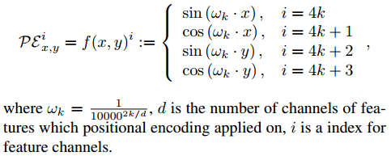

## LoFTR Supplementary Material

## 1 公式细节
### 位置编码
基于[1]的2D扩展版绝对正弦位置编码

$d$是通道数，$i$是特征通道的索引。
>[1] End-toend object detection with transformers. In ECCV, 2020

## 2 耗时统计

## 3 实现细节

### 3.1 网络结构

$\tilde{F}_{tr}$ - 变换后的特征。
#### Local Feature CNN
#### LoFTR Encoder Layer
#### Differentiable(可微) Matching with Optimal Transport

### 3.2 数据集准备
#### MegaDepth
用该数据训练outdoor环境的姿态估计和单应性估计。
移除了Image Matching Chanllenge这用于测试集和[3]指出深度图质量差的图。
保留co-visible score [0.1, 0.7]的图像对，并划分为[0.1, 0.3], [0.3, 0.5], [0.5, 0.7] 3个子集。
#### ScanNet

### 3.3 监督
#### Coarse-level
由于粗略级别的LoFTR模块作用于原始图像1/8维度的特征，每个特征代表原始图像中的像素网格，因此可能存在一对多匹配（怎么一对多？）。因此确定粗匹配的ground-truth（GT）很困难。
**使用网格中心的互最近邻（mutual nearest neighbors）来近似GT**：
取左图1/8网格的中心位置，以和深度图相同的尺度投影，并索引其深度。基于深度值和相机位姿，将网格中心warp到右图，取最近邻作为一个候选匹配。从右图到左图进行相同的处理。基于两个单向的最近邻匹配，我们只保留互最近邻作为GT（互为最近邻？不是双向验证？）。**我们不进行深度一致性检查或者对重投影距离进行阈值处理。我们经验是，对近似GT匹配的深层次约束会降低模型的性能。**
#### Fine-level
精细级LoFTR作用于以粗匹配为中心的$w\times w$窗口。对于一对粗匹配，warp左图的网格中心到右图，并计算和其最近邻的距离，并计算其是否位于对应的右图中精细窗口内。只保留左网格中心匹配的右网格中心位于精细窗口内的粗匹配，用于精细监督。

### 3.4 训练细节
如何设置样本、学习率等